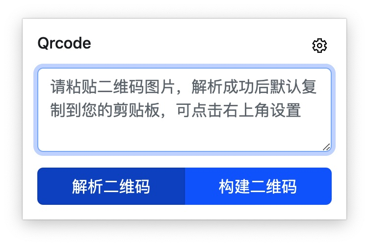

## 特点
本地处理数据，保证您的数据安全
自动化解析链路～
## 如何使用
1. 复制二维码到剪切板
2. 打开浏览器
3. 点击插件/使用默认快捷键：command/ctrl + Shift + L

### 快捷键不生效
chrome：打开链接：<chrome://extensions/shortcuts>。[chrome插件设置](chrome://extensions/shortcuts)

edge：打开链接：<edge://extensions/shortcuts>。[edge插件设置](edge://extensions/shortcuts)
设置激活扩展快捷键即可：如图

#### 手动打开
右上角插件点击之后出现管理扩展程序--->左上角三条杠点击--->点击键盘快捷键--->设置快捷键

### 链路演示

## 界面
- 解析界面

- 生成二维码界面

- 设置界面：点击插件->点击右上角齿轮

## 插件意义
在电脑看直播，水群过程中（比如各种内推图片）偶尔会出现二维码，一般情况，用户都会拿出手机，打开浏览器/相机/微信/支付宝等工具扫描二维码。对于电脑用户来说，扫码又要去找手机，较为麻烦，所以开发出这样一款插件来快速解析二维码。
目前插件市场上的二维码插件，如果是电脑场景中浏览器之外的二维码，需要用户保存在本地，然后通过拖拽或者点击上传二维码才能解析，比较繁琐。
本插件能够减少二维码解析链路：只需要复制二维码，再打开浏览器，通过快捷键/点击插件即可自动解析二维码，并且能把解析之后的内容自动复制到剪切板。
